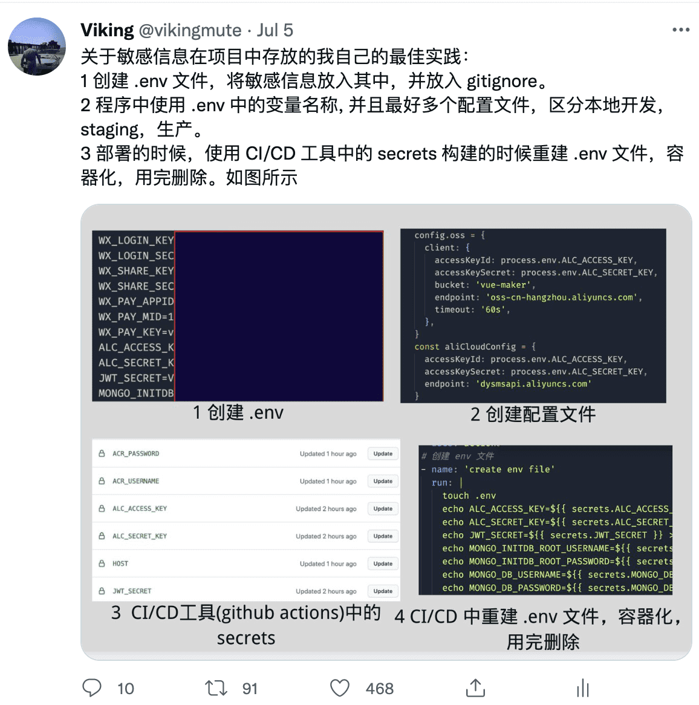
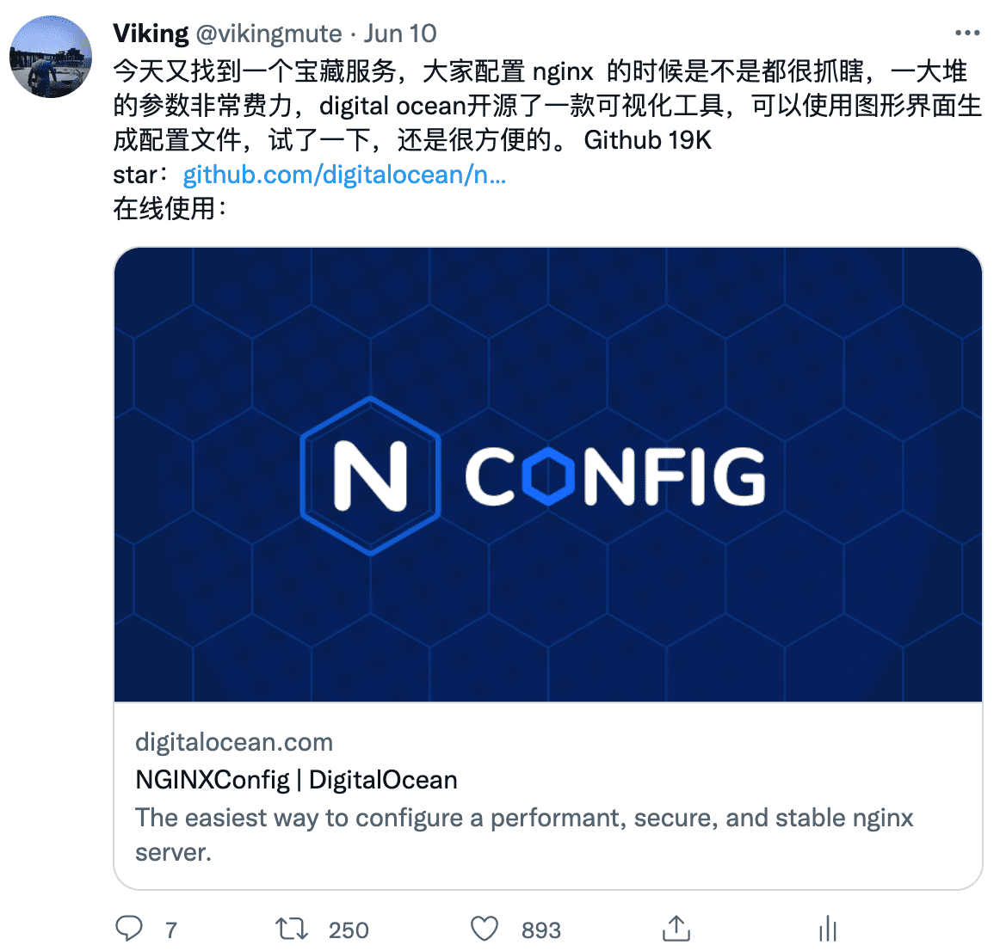
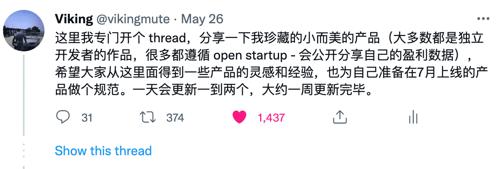

## 更进一步：打造个人品牌

### 什么是个人品牌
个人品牌（personal branding）是近些年是一个很火的词，它不仅仅局限于技术行业，还横跨了各个领域。Jeff Bezos 说过：
> Your brand is what people say about you when you’re not in the room
> 个人品牌就是当你不在场的时候别人怎样描述你的。

**个人品牌是一系列关于你自己的组合内容：比如你的专业技能，工作经验，见解，世界观别人对你的印象等等**
和一份简单的简历不同，一个好的个人品牌，可以扩大你的影响力，社交圈子，从而可以帮助我们获得更好的工作，卖出更多的产品，并在职业生涯中增加更好的机会。总之，个人品牌就像是你自己的公司，你自己是公司的 CEO 以及董事长，负责一个产品，就是开发你自己的影响力，然后在众多程序员之中脱颖而出。

一些比较知名的技术人的个人品牌：
* 阮一峰 [https://www.ruanyifeng.com/](https://www.ruanyifeng.com/)
* 陈皓 [https://coolshell.cn/](https://coolshell.cn/)
* Brad Traversy [https://twitter.com/traversymedia](https://twitter.com/traversymedia)
* Kassandra Sanch [https://twitter.com/KassandraSanch](https://twitter.com/KassandraSanch)

其他行业打造个人品牌的方式有可能有非常多的途径，如果你去看这样的文章，就会发现会有很多教条主义的方法论，但是作为技术人我认为是相对简单并且容易操作的，那就是分享和技术相关的知识或者表达相关的观点。

### 定位你的长处
不同的程序员有不同的技术栈，这里先确定自己的位置，比如说 前端开发，后端开发，UI/UX 设计，机器学习，区块链，Devops 等等，作为个人，最好是有一个特定的技术栈，再继续精进对应的技术。

比如提到 Evan You（尤雨溪）:[https://evanyou.me/](https://evanyou.me/), 大家都能想到他是前端届的大牛，Vue 的创始人。

### 创建个人简介
个人简介有点像个人品牌的商标，不需要有多长，内容可以包括你的全名，网名，头像，工作领域，成就，爱好，一些特定的链接等等，个人简介关键在于要稳定，也就是在不同的社交平台要使用一套同样的话术，让不同的平台上面的用户有更好的辨识度，比如我在慕课网的上的学生，在 B 站看了我的视频以后就会联想到我本人，然后转换成我 B 站的粉丝。
举例：[https://coolshell.cn/haoel](https://coolshell.cn/haoel)

> 大家好，我是陈皓，网名左耳朵耗子（很多人问我为什么要叫这个“一只耳”的名字，你们猜），对了，我真的不是高手，我也不是牛人，离他们的距离还很大。我从2003年开始在网上记录一些自己的技术知识和想法，今天我还在努力学习希望能成长一个高手，因为，面对生活在今天这样技术日新月异的时代，我们每个人都是一个新人。

### 分享有价值的内容

分享内容是发展个人品牌最重要的步骤，在我的亲身经验中，通过优质的分享内容可以快速的发展粉丝以及扩大自己的影响力。

#### 分享的内容形式

首先确定要以怎样的方式分享自己的内容，最简单的当然是通过文本的形式，短小精悍的内容可以通过 Twitter 和微博，比较长的文章可以通过自己的 Blog，知乎问答以及公众号。当然如果可以的话，也可以通过视频/音频的方式，当然它比文本更鲜活，不管是教程还是观点，观众都更容易理解，这样更容易转换成你的粉丝。

对于我本人而已，我会选择 视频+文本 的方式，所以创作一篇内容的时间也会比较长，对于一些技术教程，这种方式是绝佳的组合，通过视频用户可以更直观的学习，而通过文本可以方便复制一些命令代码，也可以在一些不适合播放视频的场合阅读，算是双剑合璧，

#### 分享什么内容
当你提供了有价值的内容给别人的时候，就自然会获得关注，进而转化为你的粉丝，提供一些可以分享的内容：

* 个人职业经历，努力寻找一些独特，或者可以引起共鸣的点，比如：
  * 职业发展
  * 面试技巧和准备
  * 副业开发
  * 大厂/外企见闻
  * 业内八卦
  * 自由职业/独立开发者
* 教程 （适合视频或者博客）
* 零碎的技术点（特别适合Twitter/微博），比如
  * 开发技巧
  * 好用的工具
  * 开源项目推荐等等

对于我个人来说，关注者的成长很大一部分来自技术点的分享，比如下面这几个：

分享自己在工作中的最佳实践，获得点赞和收藏。

分享工作中好用的工具，这个特别容易获得粉丝的增长，以及点赞。

以 thread 的形式分享独特的观点以及内容，是一种非常流行的方式，容易获得点赞。

#### 在哪里分享

从比较大的社交媒体开始是最好的选择，根据选择内容的不同可以分为这几类，粗体代表我本人使用过的平台

**视频**

* **Bilibili**
* **YouTube**

**文章**

* **个人博客**
* **知乎**
* **微信公众号**
* 掘金
* Dev.to
* Hashnode

**短内容**
* **Twitter**
* 微博
* 抖音
* 小红书

**开源代码**
* **Github**
* Gitee

开个社交账号非常简单，关键是要持续的输出内容，不要急功近利，可以将社交媒体作为自己的技术记录的空间，假如其中的内容能帮到许多其他人，关注者就会慢慢的进行积累。不同的社交媒体可以粉丝可以互相转化, 所以如上文所说，创建一个统一的个人简介是很重要的。

### 创建或者加入社区

除了在社交媒体上发展自己的影响力，还可以进一步在社区中扩大自己的影响力。有几个比较途径：

* 开发自己的开源项目或者给开源项目贡献代码。
* 参与线下/线上的一些技术活动（分享会/Hackathon/Workshop 等等）
* 在技术大会上演讲。

程序员这个群体有时候大家都比较社恐，但是有时候还是要主动走出自己的舒适圈子，去结交更多有意思的人，其实这篇文章的主旨很简单，**持续不断**的分享内容，当这些内容可以帮助别人的时候，自然会获得关注，不需要急功近利，这是一个长期的过程，不妨从现在就开始创建自己的**个人品牌**。
