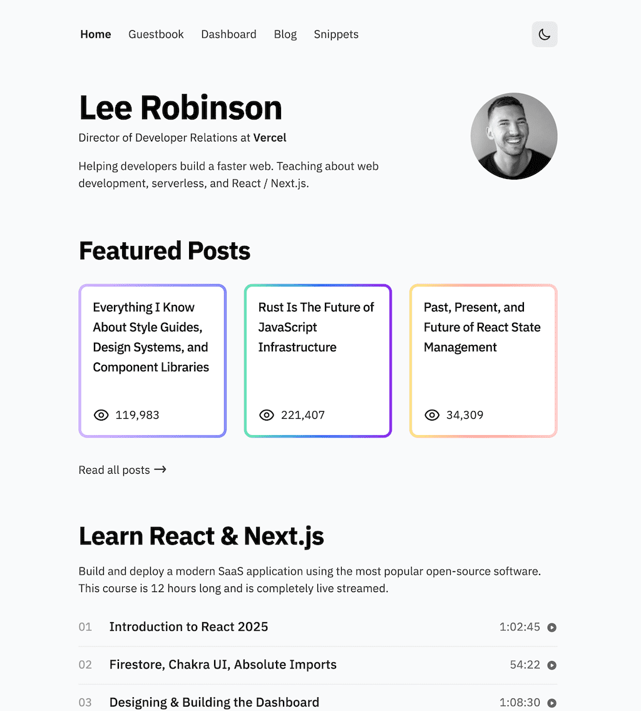
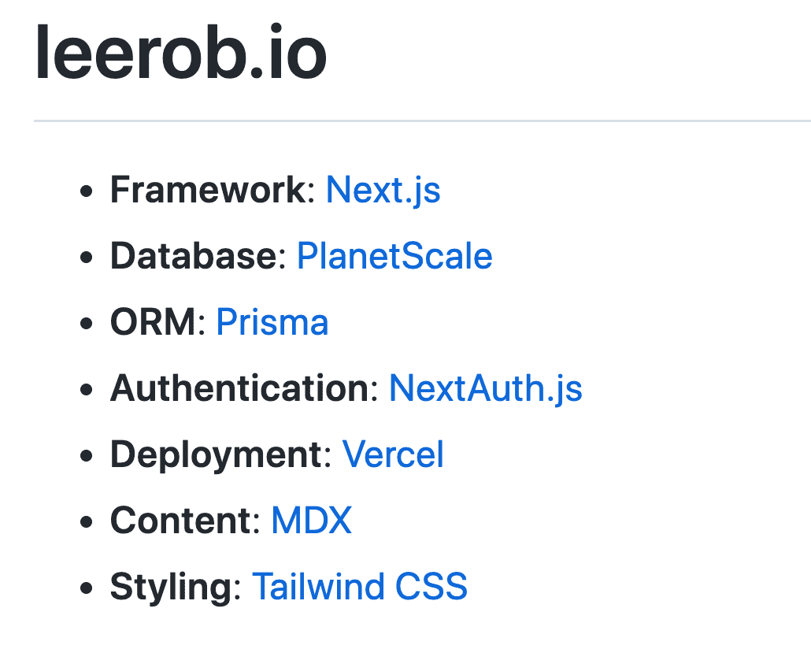
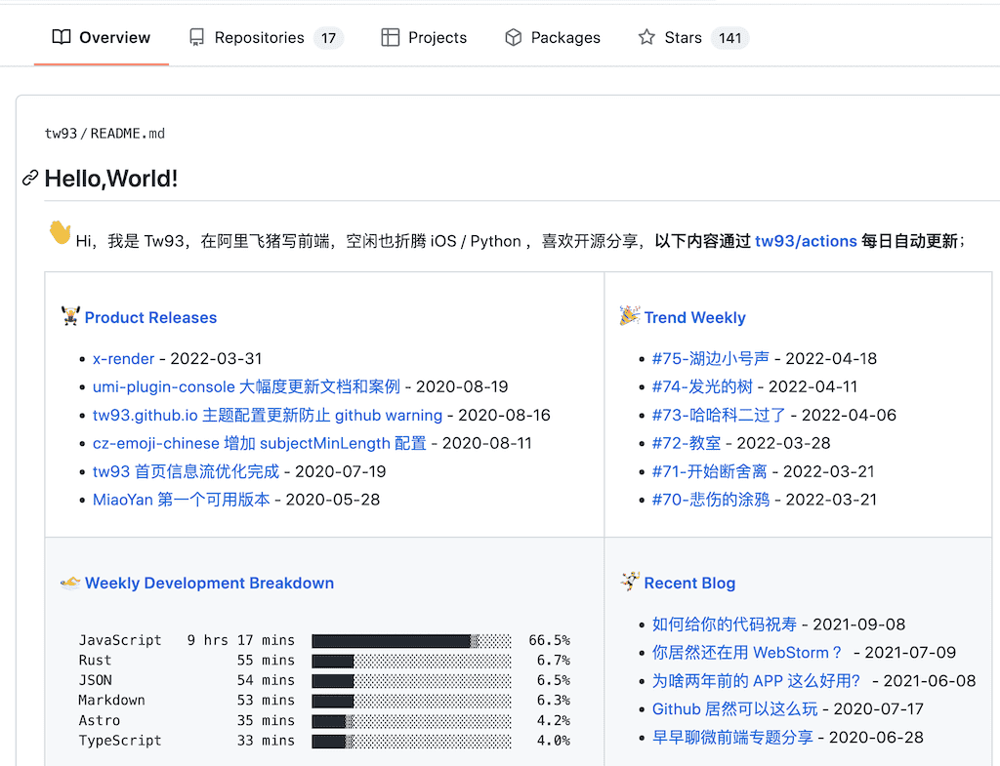

## 简历的基础内容模块
上一节我们描述了样式，这一节我们来说说内容，在总览的地方我们就说过这两部分是相辅相成的，为了避免金玉其外，败絮其中，简历中要寻找你自己的技术生涯的高光点，其实这一点不仅仅关乎于简历，在后来的面试，工作中，你也要特别注意，要围绕着这一核心进行，提升自己的综合竞争力。这一节先来说说基础内容，也就是一个技术简历应该包含的模块。

在简单简历中的简历都是围绕着在几个模块衍生的。这些模块有着一些不成文的最佳实践。

### 基本信息
这里包含你的个人信息以及联系方式，这些内容一般是固定的：

* 职位名称
* 头像（这个是可选的，在国外的简历比较流行上传头像，可以更鲜活的体现简历的辨识度，特别注意假如是上传头像的话，请使用本人真实的正面头像，不要使用像微信那样，使用卡通类型等等的头像）
* 姓名
* 工作地点（你现在的工作地点）
* 联系方式
  * 手机
  * Email（具体什么类型的邮箱无所谓，一个优秀的 HR 或者工程师对使用什么邮箱没有鄙视链）
* 出生日期（只写到年月即可）
* 剩下的可以按照自定义的要求添加一些，没有硬性规定。

### 自定义链接
有很多同学都忽视这一部分的内容，但是作为现在每天生活在互联网中的个体，在不同网站中的身份已经是你个人形象或者品牌的一部分，有着举足轻重的作用。**我建议如果大家有精力，需要去深耕这部分的内容。一个优质的链接，可以让你的简历的影响力大幅增加。** 当然不是所有的面试官都会看所有的链接内容，但是相信我，这些内容绝对是锦上添花的点。

**个人网站 - 技术博客**

在国外这种个人的技术网站称之为 *develper portfolio*，是一个程序员展示自己的重要途径，在个人网站中你可以任意挥洒你的技术，创建博客，分享观点，展示作品。他们甚至还有一系列的教程，教你怎样做一个完美的 portfolio site，比如这本书 [How to Build an Effective Dev Portfolio](https://www.joshwcomeau.com/effective-portfolio/),作者认为个人网站是招牌领域的秘密武器。本书是免费的，大家有兴趣可以看看。

我们来看几个国外优秀的个人网站。

Brittany Chiang [https://brittanychiang.com/](https://brittanychiang.com/)

Lee Robinson [https://leerob.io/](https://leerob.io/)

特别值得一提的是：Lee Robinson 完全把个人网站当作了技术实验田。将整个架构分享到了 Github 上面：[https://github.com/leerob/leerob.io](https://github.com/leerob/leerob.io)

不仅支持一键部署，还采用了很多前沿的技术：

假如你还没有，建议同学们可以使用如下工具来创建一个个人网站：

**生成器**

* Jekyll (https://jekyllrb.com/) 基于 Ruby，博客为主
* Hexo (https://hexo.io/zh-cn/) 基于 Node.js， 博客为主
* Next (https://nextjs.org/) 基于 React，高度自定义
* Gatsby (https://www.gatsbyjs.com/) 基于 React，高度自定义
* 完全自己创建，选择技术栈，可以将它作为自己技术的试验田，这是非常好的实践。

**服务器**

生产静态文件需要服务器来 Host，推荐几个免费空间：

* Vercel (https://www.vercel.com/)
* Github Pages (https://pages.github.com/)
* Gitee Pages (https://gitee.com/help/articles/4136)

**Github 或者其他 Git 服务提供商的主页**

对于程序员来说，你所编写的代码就是你最要的资产，我们最喜欢说的一句话就是"Show me the code"。
所以从功利的角度来讲，好好经营你的 Github 主页（或者其他Git 服务提供商：Gitee，GitLab 等）也尤为重要。根据工作或者学习中的兴趣，创建几个开源库，养成持续编码的习惯很重要。有几个比较流行的项目可以极大提升你整个简历的影响力。当然这里也不是让大家故意去创建一些毫无意义的 repo 来充门面。我认为兴趣是程序员最好的特质，如果你发现你对编程没有任何的激情，也许你就不适合这个行业。

Gihub 的首页现在支持 Profile，也是另外一个展示自己的途径。

上图是 tw93 的 [Github 首页](https://github.com/tw93), 这么简单的一个页面还能玩出花来，可以使用 Github Actions 自动生成最新的一系列动态。如果我是筛选简历的人，打开这个链接，会有一种 “Wow” 的感觉，自然简历也会通过筛选。

所以当你是一个应届生，没有很多工作经验，如果想要自己的简历更有竞争力，那么这些方面我认为是要注意的，虽然是简简单单的两个链接，但是当你用心去经营以后，就会发现它们不仅能够提升你的技术实力，也能从另外一个程度上扩大你的技术影响力。

**LinkedIn 主页**

如果你是一个拥有多年工作经验的程序员，我建议你创建一个 LinkedIn 账户。LinkedIn 作为全世界最大的职业网络，还是有一定的价值的，尤其是一些外企的 HR 会对 LinkedIn 比较青睐，会帮你扩大自己的圈子，同时收获更多的工作机会。
这是一个 Nice to have 的内容。我本人作为一个程序员，对 LinkedIn 并没有特殊的偏好，我认为他的影响力要低于前面两块内容。

写完了内容的前两部分，下一节我们来谈谈比较重要的[工作经验以及教育经历](/guide/content-more)。

