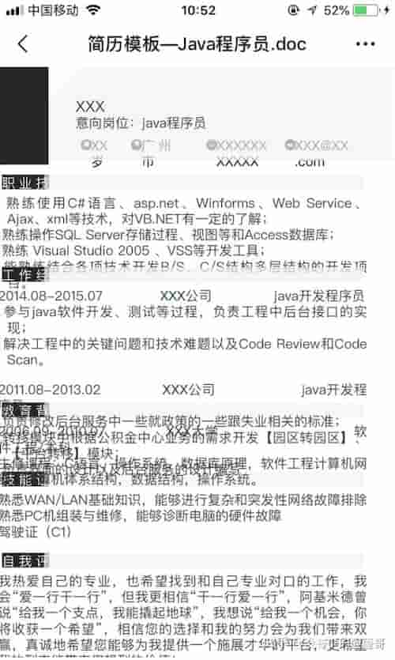
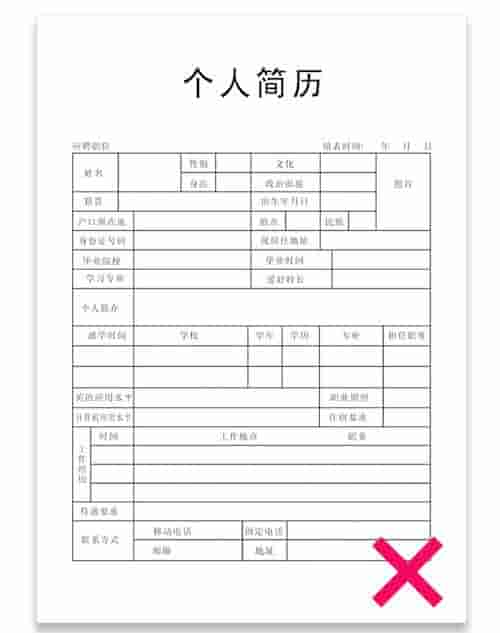
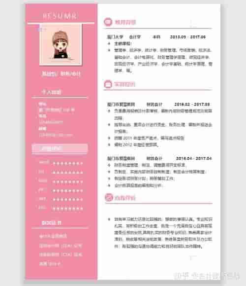
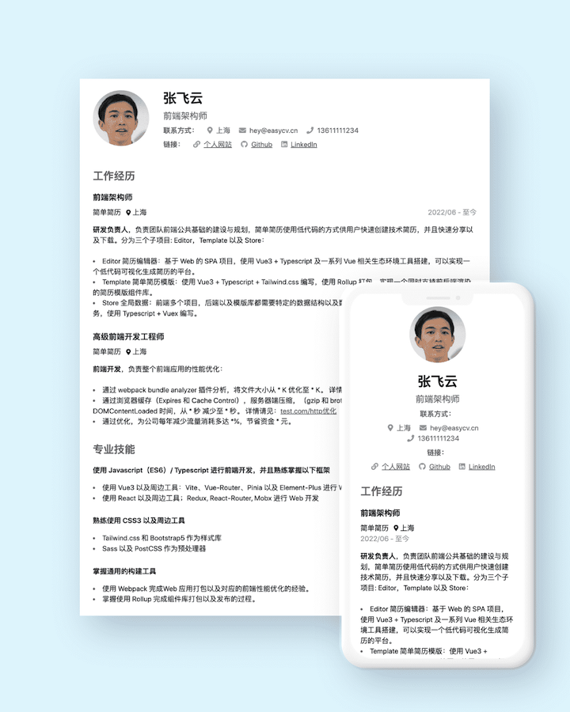
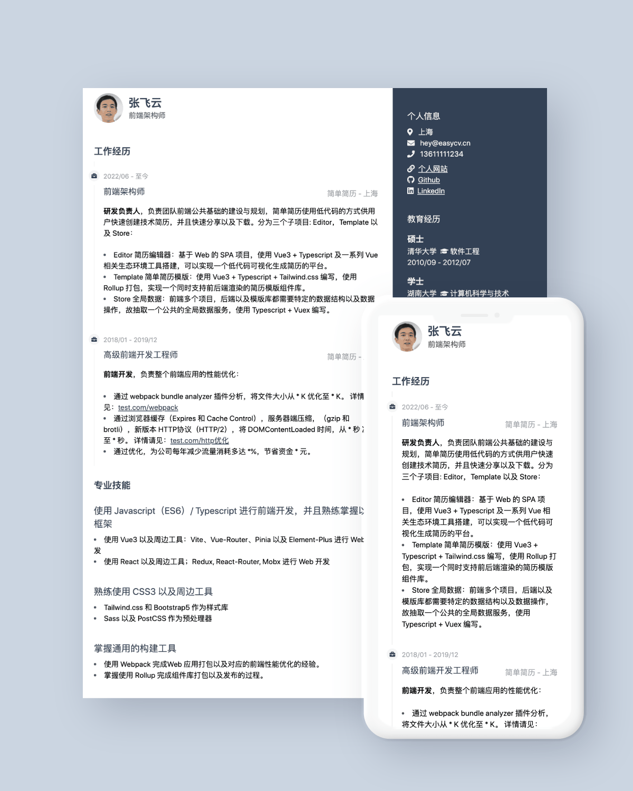
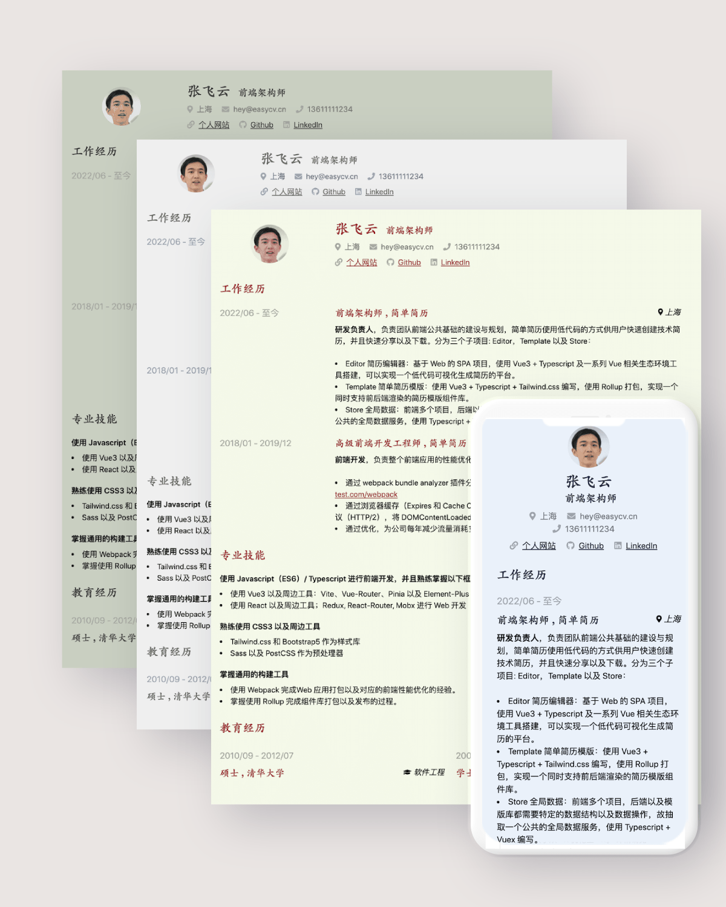

## 简历的样式

先来说说第一个问题，简历的样式（styling），也就是经常说的模版。抛开内容不说，视觉上的第一印象我认为是**很重要**的。

### 错误的案例

首先给大家展示三种错误的案例，大家看看这种简历是不是在大家那里也比较常见？

* 第一个不用多说了，简历格式混乱，连标题的大小样式都没有统一，各个模块非常混乱，颜色乱七八糟，当然这里和 word 格式的兼容性有关系，所以我建议大家最好选用 pdf 格式的文件。

* 第二个，上个世纪从历史垃圾堆里面爬出来的模版，一大堆无用的信息，毫无重点，看起来索然无味，读起来味同嚼蜡。

* 当然我还看过一些样式特别过头的简历，整个格式花里胡哨，各种色彩交织在一起，整的和一个调色盘一样。有个成语叫过犹不及，说的就是这种简历，我觉得这种格式应该避免，尤其是很多人将专业技能用一种评分的方式展示，多少多少星，是一种更要避免的方式。一旦这些设计分散掉简历内容的重点，便会让大多数面试官烦躁，没耐心再继续看！

### 优美的样式

那么先说完了错误的情况，那么我认为好的简历模版是什么样子的？

这里有三种不同的流派，我认为都可以按照你的喜好进行尝试。

* 第一种是**极简风**

以黑白两色为主题，但是字体，间距，字号，颜色都非常舒服，给人有种无印良品的感觉，极简其实是很难的，要特别把握好平衡，不能太简陋，又不能太花哨。点击查看在线版本：[极简主义](https://r.easycv.cn/themePure) 的效果。

* 第二种是**现代风格**

有的简历指南盲目崇拜简约风格，仿佛只有中性色彩才能脱颖而出。但是作为一个程序员的简历，这种观念是错误的，一个双栏布局，能容纳更多的信息，颜色字体都特别设计，信息饱满，这就是那种让前端工程师眼前一亮的设计，假如我看到这个简历，会一下让我会特别的多看两眼。点击查看在线版本：[时间线](https://r.easycv.cn/themeTimeline) 的效果。

* 第三种是**别出心裁的风格**

还可以加入一些特殊的设计，但是一定不要过犹不及，太多的色彩就会造成上面反例 3 的问题。比如这个简历的多种中国风配色以及特殊的楷体设计，都会比较吸引眼球。点击查看在线版本：[如梦令](https://r.easycv.cn/themePaper) 的效果。

不难发现，好的样式需要考虑几个要素：
* 选择字体（基本为系统默认字体，要想玩花样可以适当加入不同字体），以及不同文本的字号（标题，二级标题，正文，加粗等等），符合语义化。
* 间距，良好的间距可以让文本更易读，主次分明。不要太挤也不好太宽。否则就会产生上面反例 1 的问题。
* 配色，可以参考 [Ant Design](https://ant.design/docs/spec/colors-cn) 配色的选择,特别注意也要注意中性色的设计, 不同的权重的文本可以使用不同的中性色。
> 中性色包含了黑、白、灰。在蚂蚁中后台的网页设计中被大量使用到，合理地选择中性色能够令页面信息具备良好的主次关系，助力阅读体验。

* 布局，可以在单栏和双栏之间选择，看个人的喜好。

### 抛开简单的文件格式，做更多扩展

除了上面几个方面之外，还可以抛开简历这个简单的文件格式，衍生更多的亮点。
假如你是一个程序员，我建议你可不妨使用 HTML+CSS 来创建适合 Web 格式的标准的网页版简历，它有下面几个优势：

* 基于 Web，可以轻松的提供线上版本，通过一个 URL 可以直接访问对应的简历，便于分享。
* 可以提供[响应式](https://developer.mozilla.org/zh-CN/docs/Learn/CSS/CSS_layout/Responsive_Design)的简历。在不同的设备上有更良好的体验。
* 可以提供更好的[可访问性](https://developer.mozilla.org/zh-CN/docs/learn/Accessibility)，让残疾人士也可以访问。
* 基于浏览器，天生支持可打印以及下载为 PDF。
* 基于 Javascript， 可以提供更多动态功能，比如点击下载一份 PDF 格式的简历，或者是扫码分享给别的用户。
* 提供更丰富的信息以及排版，比如添加适合 Web 格式的图标（SVG），让整个简历更生动活泼。

如果你能在样式上做到上面所说的点，不仅有普通的 PDF 格式简历，同时还有在线简历。从我自身的经历来看，我遇到过一个这样的求职邮件，成功的吸引了我的眼球，我会比别的简历要看的认真的多，最终他也成功的拿到了 Offer。如果一个公司崇尚的是工程师文化，那么相信我，这样做肯定是最优解。

这就是简历样式的建议。看起来是挑选模版那么简单，但是假如真想做好，还是要下一定的功夫的。

### 在哪里找到模版

那么在哪里找到比较符合要求的模版呢？给大家提供三个途径。

* 自己设计，我见过很多工程师，对 Web 技术比较熟悉，而且对设计也比较感兴趣，会自己设计并且编码完成，在这个过程中也会很有成就感以及乐趣。
* 我的作品：[简单简历](https://easycv.cn)为大家提供了符合上诉要求的更多的简历模板，请点击[简单简历模版](https://easycv.cn/templates)查看。
* 一个 GitHub Repo 搜集了一系列程序员相关的中文简历模版，供大家参考：[https://github.com/dyweb/awesome-resume-for-chinese](https://github.com/dyweb/awesome-resume-for-chinese)

